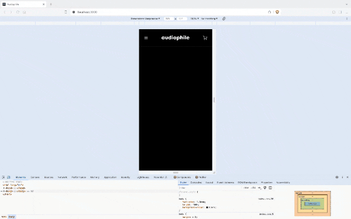
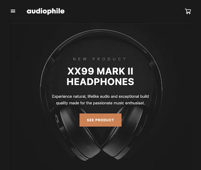
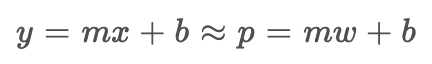

# How I'm Building it: <br/>[Frontend Mentor Audiophile e-Commerce website](https://www.frontendmentor.io/challenges/audiophile-ecommerce-website-C8cuSd_wx)

### Table of contents

- [Day 1: Form Elements and Theme](#day-1-form-elements-and-theme)
- [Day 2: Header and Screen Monitor](#day-2-header-and-screen-monitor)
- [Day 3: Home Page Banner](#day-3-home-page-banner)
- [Day 4: Product Category Card](#day-4-product-category-card)

### Day 1: Form Elements and Theme

#### **Theme**

The first day I decided to tackle the fundamental elements of the project, namely reusable buttons, a counter, inputs and the color theme. The lattermost was accomplished by [customizing my color theme](https://tailwindcss.com/docs/customizing-colors#naming-your-colors) in `tailwind.config.js` based on the provided design system.

#### **Buttons**

Inspired by MaterialUI's way of doing things, I built the button component to be convenient and customizable. The `sx` optional property would allow me to provide addtional on-the-fly styling in case I needed a minor modification here or there and the `variant` prop allowed me to access a variety of buttons without having to build multiple components.

`buttonStyles` is an object with a `number | string` key and a `string` property that will act as our html element's className

```tsx
export default function Button({
  children,
  variant,
  sx,
}: {
  children: ReactNode
  variant: number | string
  sx?: React.CSSProperties | undefined
}) {
  return (
    <button
      className={
        'text-[1.3rem] font-bold py-[1.5rem] px-[3.2rem] uppercase w-full max-w-[60rem] tracking-[1px] ' +
        buttonStyles[variant]
      }
      style={sx}
    >
      {children}
      {variant === 3 || variant === '3' ? <ChevronRight /> : null}
    </button>
  )
}
```

<br/>

The input element was a little more intensive as I wanted to build my own client-side verification. To accomplish this, I added an `error` state variable. This is an object that has two properties: status, a `boolean` and message, a `string`. The component's styling depends on whether or not there is an active error (as determined by a blank input after focusing); a red label, error message and outline warns the user that the input is invalid.


#### **Text**

I also took a similar approach to typography by building a `Text` component that wraps text and renders the text in an element with a specified tag and styling. Using the typography in the design system I built an object that has a key type (string) and a CSS property object as the value. I then use this object to plug in styles based on the type prop.

```tsx
// Text.tsx

export default function Text({
  type,
  children,
}: {
  type: string
  children: ReactNode
}) {
  let element
  const style: React.CSSProperties | undefined = {
    textTransform: 'uppercase',
    ...textStyles[type],
  }

  switch (type) {
    // ...
    case 'h6':
      element = <h6 style={style}>{children}</h6>
      break
    case 'overline':
      element = <p style={style}>{children}</p>
      break
    case 'link':
      element = (
        <p
          style={style}
          className='hover:!text-caramel transition-colors duration-300'
        >
          {children}
        </p>
      )
      break
    //...
  }

  return <>{element}</>
}
```

> In my opinion the use of a tailwind class in the link text is a bit gaudy but I can't apply styling based on element state in the style prop

<br/>

```tsx
// textStyles.ts

interface TextStyle {
  [key: string]: React.CSSProperties | undefined
}

const textStyles: TextStyle = {
  h1: {
    fontSize: '5.6rem',
    lineHeight: '5.8rem',
    letterSpacing: '0.2rem',
    fontWeight: 500,
  },
  h2: {
    fontSize: '4rem',
    lineHeight: '4.4rem',
    letterSpacing: '0.15rem',
    fontWeight: 500,
  },

  // ...
}

export default textStyles
```

```tsx
// DesktopHeader

// ...
<li>
  <a href='#'>
    <Text type={'link'}>Home</Text>
  </a>
</li>
// ...
```

<br/>

### Day 2: Header and Screen Monitor

#### **Header**

The Header component uses conditional rendering based on screen size. Using a custom hook, I attach an event listener to the window and set the state, a custom enum, based on the screen size

```tsx
// useScreenMonitor.tsx

export default function useScreenMonitor() {
  const [mobile, setMobile] = useState<DISPLAY_MODE>(
    window.innerWidth > 768
      ? DISPLAY_MODE.DESKTOP
      : window.innerWidth > 480
      ? DISPLAY_MODE.TABLET
      : DISPLAY_MODE.MOBILE
  )

  useEffect(() => {
    const handleResize = () => {
      setMobile(
        window.innerWidth > 768
          ? DISPLAY_MODE.DESKTOP
          : window.innerWidth > 480
          ? DISPLAY_MODE.TABLET
          : DISPLAY_MODE.MOBILE
      )
    }
    window.addEventListener('resize', handleResize)
    return () => window.removeEventListener('resize', handleResize)
  }, [])

  return mobile
}
```

<br/>

```tsx
// Header.tsx

export default function Header() {
  let mode = useScreenMonitor()
  let element
  switch (mode) {
    case DISPLAY_MODE.DESKTOP:
      element = <DesktopHeader />
      break
    case DISPLAY_MODE.TABLET:
      element = <TabletHeader />
      break
    case DISPLAY_MODE.MOBILE:
      element = <MobileHeader />
  }
  return element
}
```

<br/>



### Day 3: Home Page Banner

#### **Math!**

The tablet product banner was giving me a bit of trouble. When the screen was 481px (minimum breakpoint for a tablet), ideally the background image should take up about 140% of the container's width, however, at 768 (maximum breakpoint ...) the image looked best at about 90% or so. I tried to use the former setting but realize when the screen shrunk it wasn't exactly what I had in mind.




<br/>

The headphones in the left image are significantly smaller than the intended design. So I needed to adjust the image so that it scaled up, but not at a 1:1 ratio. It needed to grow slower than the width of the screen. I had to math it out! Using css's calc function if I found a formula, I could get my image to scale how I wanted it to. I needed the rate of change of the image in pixels or Delta p. So I used the formula for the slope of a line.


In this formula, and when dealing with graphs in general, the dependent variable is y and the independent is x. In my case, my dependent variable is pixels (p) and dependent is width (w).



I tinkered with the dev tools to see the sizes I wanted at 481px and 768px (673 and 691 pixels, respectively) and plugged these into my equation. This gave me a slope (_m_) of 0.063. Using the point-slope form of a line (_y = mx + b_) I then solved for _b_ using _y = 673_ and _w = 481_. The final equation is _p = 0.063w + 643_. Plugging this value into the background size property using the calc function gave me an image that scaled perfectly.

```tsx
// Product.tsx

// ...
const HeaderProductStyle: { [key: string]: string } = {
  // classNames
  mobile:
    'text-center pt-[10.8rem] pb-[11.2rem] px-[2.4rem] bg-black bg-[url(./images/home/mobile/image-header.jpg)] bg-cover bg-no-repeat bg-bottom',
  tablet:
    'text-center pt-[12.6rem] pb-[16.7rem] px-[2.4rem] bg-black bg-[url(./images/home/tablet/image-header.jpg)] bg-[length:calc(100vw*0.063_+_643px)] bg-no-repeat bg-bottom',
  // ...
}

// ...
```

> w in the calc function is calculated by 100vw

<br/>


> From left to right: max tablet (768), min tablet (481px) before, min tablet (481px) after

### Day 4: Product Category Card

#### **Text Component Refactor**

I keep running into this problem with Frontend Mentor projects where there is some typography that isn't in the design system, not entirely missing, but maybe just a little different. I built my _Text_ component to return the desired typography based on [it's _type_ prop](#text), but like the pseudo class problem I had, these one-off stylings resulted in less than elegant solutions. So I've decided to overhaul my _Text_ component. (Note the tense has changed because I'm currently writing this as I'm building. The previous secions were written after the fact)

I've made the _type_ prop optional for completely new custom styling not already predefined and I've added another optional prop called _sx_. This is inline css styling that I'll apply after the type styling to override it.

```tsx
export default function Text({
  type,
  children,
  className,
  sx,
}: {
  type?: string | undefined
  children: ReactNode
  className?: string
  sx?: React.CSSProperties | undefined
}) {
  let element
  const style: React.CSSProperties | undefined = {
    textTransform: 'uppercase',
    ...textStyles[type as string],
  }

  switch (type) {
    case 'h1':
      element = (
        <h1 className={className} style={{ ...style, ...sx }}>
          {children}
        </h1>
      )
      break
    // ...
  }

  return <>{element}</>
}
```

#### **Categroy Card Component**

Here is what it should look like


<br/>

And here is what I've built so far


<br/>

And here is the code

```tsx
// ...
<div className='category-card w-full max-w-[35rem] relative'>
  
  <div className='category-card-text bg-anti-flash-white pt-[8.8rem] pb-[2.2rem] absolute w-full mx-auto bottom-[-64px] z-0'>
    <Text
      type='body'
      sx={{
        color: '#000',
        textTransform: 'uppercase',
        fontSize: '1.5rem',
        fontWeight: '700',
        letterSpacing: '0.107rem',
        textAlign: 'center',
      }}
    >
      Earphones
    </Text>
    <Button variant={3} svgSx={{ stroke: '#D87D4A' }}>
      Shop
    </Button>
  </div>
</div>
// ...
```

<br/>

However, since this component appears all over the place I have to tweak it to make it resuable. Each component will need to have a unique id, title, image, alt attribute and behavior when clicked. The id, title, image, and alt attribute I'll store in an object and use an enum type as the object property. I'll figure out the behavior once I start adding functionality to my app.

<br/>

```tsx
// dataTypes.tsx

export enum CATEGORY {
  HEADPHONES = 'headphones',
  SPEAKERS = 'speakers',
  EARBUDS = 'earbuds',
}

export const categoryData: {
  [key in CATEGORY]: { title: string; img: string; imgAlt: string }
} = {
  [CATEGORY.HEADPHONES]: {
    title: 'headphones',
    img: Headphones,
    imgAlt: 'Audiophile headphones',
  },
  [CATEGORY.SPEAKERS]: {
    title: 'speakers',
    img: Speaker,
    imgAlt: 'Audiophile speaker',
  },
  [CATEGORY.EARBUDS]: {
    title: 'earbuds',
    img: Earbuds,
    imgAlt: 'Audiophile earbbuds',
  },
}
```

<br/>

```tsx
// CategoryCard.tsx

export function CategoryCard({ type }: { type: CATEGORY }) {
  const { title, img, imgAlt } = categoryData[type]
  return (
    <div
      id={`category-card-${title}`}
      className='category-card w-full max-w-[35rem] relative'
    >
      
      <div
        className='category-card-text bg-anti-flash-white pt-[8.8rem]
        pb-[2.2rem] absolute w-full mx-auto bottom-[-64px] z-0'
      >
        <Text
          type='body'
          sx={{
            color: '#000',
            textTransform: 'uppercase',
            fontSize: '1.5rem',
            fontWeight: '700',
            letterSpacing: '0.107rem',
            textAlign: 'center',
          }}
        >
          {title}
        </Text>
        <Button variant={3} svgSx={{ stroke: '#D87D4A' }}>
          Shop
        </Button>
      </div>
    </div>
  )
}
```
