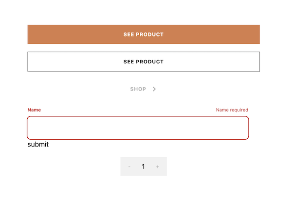

# How I'm Building it: <br/>[Frontend Mentor Audiophile e-Commerce website](https://www.frontendmentor.io/challenges/audiophile-ecommerce-website-C8cuSd_wx)

### Day 1: Form Elements & Theme

#### **Theme**

The first day I decided to tackle the fundamental elements of the project, namely reusable buttons, a counter, inputs and the color theme. The lattermost was accomplished by [customizing my color theme](https://tailwindcss.com/docs/customizing-colors#naming-your-colors) in `tailwind.config.js` based on the provided design system.

#### **Buttons**

Inspired by MaterialUI's way of doing things, I built the button component to be convenient and customizable. The `sx` optional property would allow me to provide addtional on-the-fly styling in case I needed a minor modification here or there and the `variant` prop allowed me to access a variety of buttons without having to build multiple components.

`buttonStyles` is an object with a `number | string` key and a `string` property that will act as our html element's className

```tsx
export default function Button({
  children,
  variant,
  sx,
}: {
  children: ReactNode
  variant: number | string
  sx?: React.CSSProperties | undefined
}) {
  return (
    <button
      className={
        'text-[1.3rem] font-bold py-[1.5rem] px-[3.2rem] uppercase w-full max-w-[60rem] tracking-[1px] ' +
        buttonStyles[variant]
      }
      style={sx}
    >
      {children}
      {variant === 3 || variant === '3' ? <ChevronRight /> : null}
    </button>
  )
}
```

The input element was a little more intensive as I wanted to build my own client-side verification. To accomplish this, I added an `error` state variable. This is an object that has two properties: status, a `boolean` and message, a `string`. The component's styling depends on whether or not there is an active error (as determined by a blank input after focusing); a red label, error message and outline warns the user that the input is invalid.



#### **Text**

I also took a similar approach to typography by building a `Text` component that wraps text and renders the text in an element with a specified tag and styling. This too was based on the varied texts-sizes, line-heights, and character spacings laid out in the design system.

```tsx
// Text.tsx

export default function Text({
  type,
  children,
}: {
  type: string
  children: ReactNode
}) {
  let element
  const style: React.CSSProperties | undefined = {
    textTransform: 'uppercase',
    ...textStyles[type],
  }

  switch (type) {
    // ...
    case 'h6':
      element = <h6 style={style}>{children}</h6>
      break
    case 'overline':
      element = <p style={style}>{children}</p>
      break
    case 'link':
      element = (
        <p
          style={style}
          className='hover:!text-caramel transition-colors duration-300'
        >
          {children}
        </p>
      )
      break
    //...
  }

  return <>{element}</>
}
```

> In my opinion the use of a tailwind class in the link text is a bit gaudy but I can't apply styling based on element state in the style prop

```tsx
// textStyles.ts

interface TextStyle {
  [key: string]: React.CSSProperties | undefined
}

const textStyles: TextStyle = {
  h1: {
    fontSize: '5.6rem',
    lineHeight: '5.8rem',
    letterSpacing: '0.2rem',
    fontWeight: 500,
  },
  h2: {
    fontSize: '4rem',
    lineHeight: '4.4rem',
    letterSpacing: '0.15rem',
    fontWeight: 500,
  },

  // ...
}

export default textStyles
```

```tsx
// DesktopHeader

// ...
<li>
  <a href='#'>
    <Text type={'link'}>Home</Text>
  </a>
</li>
// ...
```

### Day 1: Form Elements & Theme

#### **Header**

The Header component uses conditional rendering based on screen size. Using a custom hook, I attach an event listener to the window and set the state, a custom enum, based on the screen size

```tsx
// useScreenMonitor.tsx

export default function useScreenMonitor() {
  const [mobile, setMobile] = useState<DISPLAY_MODE>(
    window.innerWidth > 768
      ? DISPLAY_MODE.DESKTOP
      : window.innerWidth > 480
      ? DISPLAY_MODE.TABLET
      : DISPLAY_MODE.MOBILE
  )

  useEffect(() => {
    const handleResize = () => {
      setMobile(
        window.innerWidth > 768
          ? DISPLAY_MODE.DESKTOP
          : window.innerWidth > 480
          ? DISPLAY_MODE.TABLET
          : DISPLAY_MODE.MOBILE
      )
    }
    window.addEventListener('resize', handleResize)
    return () => window.removeEventListener('resize', handleResize)
  }, [])

  return mobile
}
```

<br/>
<br/>
<br/>

```tsx
// Header.tsx

export default function Header() {
  let mode = useScreenMonitor()
  let element
  switch (mode) {
    case DISPLAY_MODE.DESKTOP:
      element = <DesktopHeader />
      break
    case DISPLAY_MODE.TABLET:
      element = <TabletHeader />
      break
    case DISPLAY_MODE.MOBILE:
      element = <MobileHeader />
  }
  return element
}
```

<br/>
<br/>
<br/>


